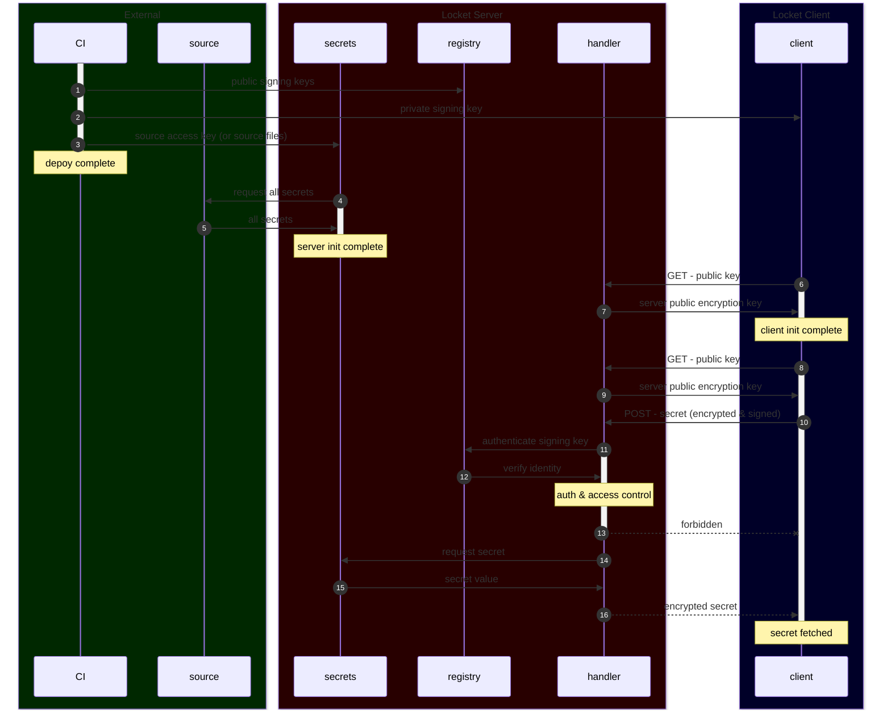

  (use "git add <file>..." to update what will be committed)
  (use "git restore <file>..." to discard changes in working directory)
	modified:   cmd/infra/infra/config.go
# 🔐 locket ❤️

secrets management service

## Purpose
Locket is a secrets cache for production services. It stores secrets in memory, loaded from external secrets cache, environment, or .env file as source. Why? Because the 1password GUI is great for business use, but the sacntioned 1password cache was flaky, and I wanted a go based soluton that abstracts away secret origin while providing tight access control and integration with existing deployment.

## Overview

### 1-3 Deploy
Create [registry](./registry.go) and distribute signing keys.

### 4-5 Init Server
Load secrets using any struct that satisfies the `source` interface.

struct | source
--- | ---
`env` | local environment
`dotenv` | `.env` file
`onepass` | 1password server

### 6-7 Init Client
Fetch server public encryption key.

### 8-9 Refetch public encryption key
Server may generate a new public key upon restart. No caching is currently implemented. 🤷

### 10-12 Enforce Access Control
- clients must encrypt and sign every request
- clients can only requeest their own secrets

### 13-15 Fetch & Return Secret
- responses are encrypted

 ## Examples
See [tests](./locket_test.go) for examples, and checkout docstings for extensive descriptions.
