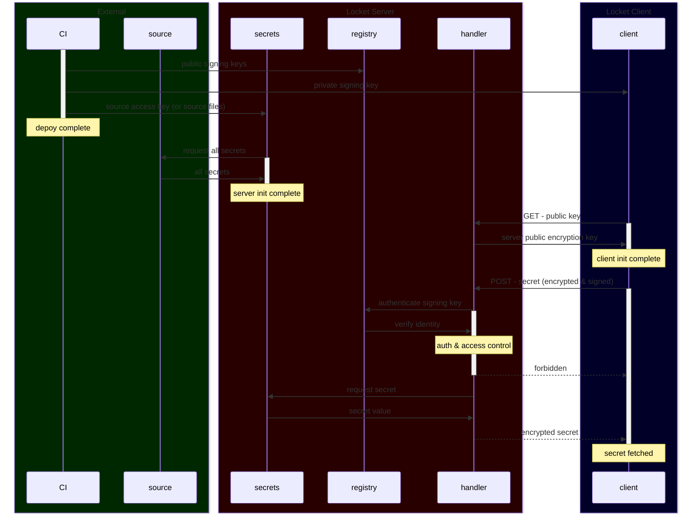

# 🔐 locket ❤️

[](https://github.com/grackleclub/locket/actions/workflows/go.yml)

secrets management service

## Systems Diagram


## usage
Locket is a secrets cache for production services. It only stores secrets in memory, relying on external secrets cache or .env file as source. Why? Because the 1password GUI is great for business use, but working with the 1password client container was a pain in the ass, and this wrapper provides flexibility to swap secrets origin without changing produciton architecture.

Locket works with three steps:
1. setup [registry](#registry) of allowed services
2. spin up locket [server](#server)
3. [client](#client)

### registry
During infrstructure deploy, registry is created. Clients authenticate to the server using an ed25519 signing key.

```go
import "github.com/grackleclub/locket"

var services = []string{"api", "webserver"}

// create signing keys for autenticating clients to server
registry, servicePrivateKeys, err := locket.Bootstrap(services)
if err != nil {
    panic(fmt.Errorf("bootstrap locket: %w", err))
}

// write registry to file
 err := WriteRegistry(path.Join("deploy", "registry.yml"))
if err != nil {
    panic(fmt.Errorf("write registry: %w", err))
}

// not shows: distribute servicePrivateKeys so services
```

### server
// TODO expand/improve


### client
// TODO expand/improve

## design outline
1. init `secrets` server
    - read secrets
        - prod: external source
        - dev: from env
    - read config for each service
        - allowed service and IP(s)
        - associated client ed25519 public key(s)
        - allowed vars
3. init `secrets` client
    - get server's public key
    - encrypt request with public key
    - sign request with ed25519
    - send request:
        - encrypted payload
        - payload's ed25519 signature
        - own public RSA key
4. `secrets` server
    - verifies ed25519 signature
    - decrypts payload
    - checks ACL
    - ecrypts response of allowed secrets with requestor's public key
5. `secrets` client
    - decrypts

 
